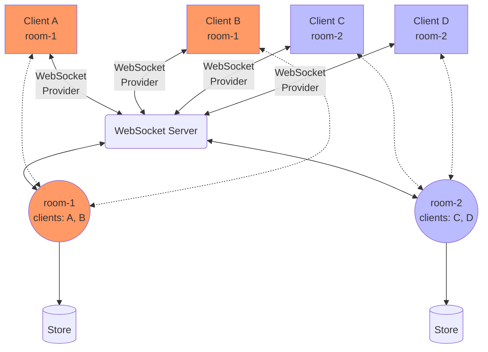

# Ypy-websocket

Ypy-websocket is an async WebSocket connector for [Ypy](https://github.com/y-crdt/ypy).

---

**Documentation**: <a href="https://davidbrochart.github.io/ypy-websocket" target="_blank">https://davidbrochart.github.io/ypy-websocket</a>

**Source Code**: <a href="https://github.com/y-crdt/ypy-websocket" target="_blank">https://github.com/y-crdt/ypy-websocket</a>

---

Ypy-websocket is a Python library for building WebSocket servers and clients that connect and synchronize shared documents.
It can be used to create collaborative web applications.

The following diagram illustrates a typical architecture. The goal is to share a document among several clients.

Each client has an instance of a [YDoc](https://ypy.readthedocs.io/en/latest/autoapi/y_py/index.html#y_py.YDoc), representing their view of a document. A shared document also lives in a [room](./reference/Room.md) on the server side. Conceptually, a room can be seen as the place where clients collaborate on a document. The WebSocket to which a client connects points to the corresponding room through the endpoint path. In the example below, clients A and B connect to a WebSocket at path `room-1`, and thus both clients find themselves in a room called `room-1`. All the `YDoc` synchronization logic is taken care of by the [WebsocketProvider](./reference/WebSocket_provider.md).

Each update to a shared document can be persisted to disk using a [store](./reference/Store.md), which can be a file or a database.

